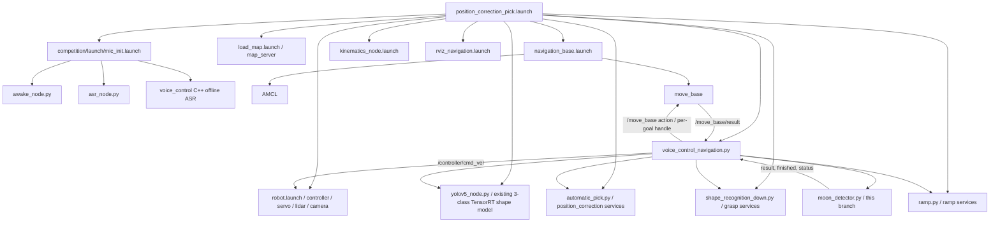
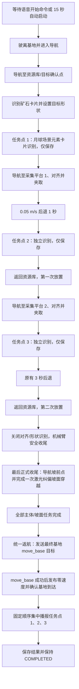
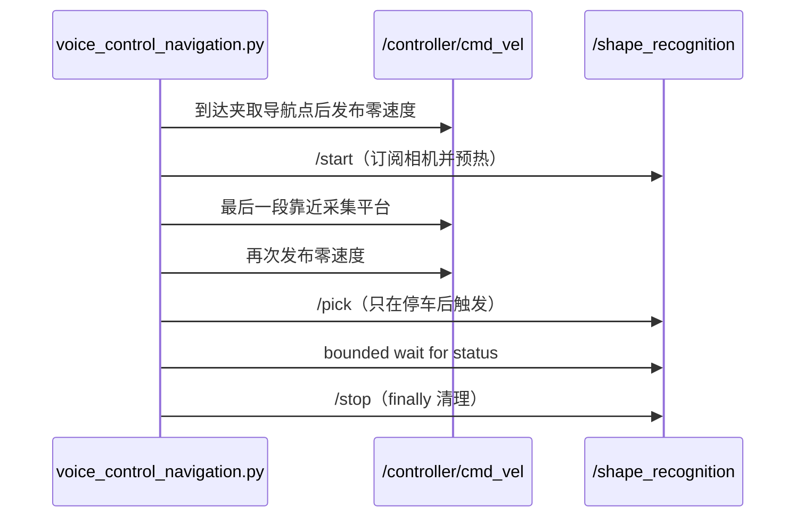

# 当前比赛程序架构与任务流程

## 1. 结论

当前真实比赛入口是 `src/competition/scripts/navigation_transport/position_correction_pick.launch`，主控制程序是 `src/competition/scripts/navigation_transport/voice_control_navigation.py`。项目是 ROS1/catkin 工作空间，不是 ROS2 项目。

三个“月球场景元素卡片识别”任务点是原比赛流程中的三个插入点，不是一个独立的三点巡检任务，也不是整体任务完成条件。第三个识别点之后，基线源码仍有后退、第二次放置、功能节点收尾以及返航坡道相关动作；不得在第三个识别函数中直接返航或播报。

本文件中的“基线”指创建本分支前的 `voice_control_navigation.py` 行为；“本分支实现”指本次增量加入的 ROS1 检测节点、任务生命周期和结果保存逻辑。当前 Windows 开发机不能运行 ROS 图，因此话题和服务均为源码静态确认，实机连接状态见 `docs/runtime_environment_report.md`。

## 2. Launch 调用关系



`position_correction_pick.launch` 的源码顺序为：加载比赛参数和麦克风，读取地图，启动机器人底层，启动三分类矿石卡片 YOLO、运动学、AMCL/move_base、夹取平台对齐、坡面处理、形状夹取、主比赛节点和 RViz。

## 3. 已确认接口

| 功能 | 源码静态确认的接口 | 说明 |
| --- | --- | --- |
| 语音结果 | `/asr_node/voice_words`，`std_msgs/String` | `voice_control_navigation.py` 订阅；离线语音链路由 `awake_node.py`、`asr_node.py` 和 `voice_control` 组成 |
| 导航目标 | `/move_base`，`move_base_msgs/MoveBaseAction` | 正式比赛使用低层 `ActionClient` 返回的独立 goal handle；`/move_base_simple/goal` 只保留兼容调试入口 |
| 导航结果 | goal handle 终态及 `/move_base/result` | 正式等待只接受当前句柄的 `SUCCEEDED`，避免连续目标切换时 `SimpleActionClient` 跟踪竞态 |
| 底盘速度 | `/controller/cmd_vel`，`geometry_msgs/Twist` | 主程序、对齐节点和坡面节点均可能发布；`move_base` 也重映射到该话题 |
| 里程计/雷达 | `/odom`、`/scan` | 主程序用于航向、距离和返坡激光纠偏 |
| 机械臂 | `/servo_controllers/port_id_1/multi_id_pos_dur` | 总线舵机动作；夹取还调用运动学服务 |
| 对齐/放置 | `/position_correction/start`、`pick_1`、`pick_2`、`place_3` 等 | `automatic_pick.py` 提供，状态参数为 `/position_correction/status` |
| 形状夹取 | `/shape_recognition/start`、`pick`、`stop`/`close` | `shape_recognition_down.py` 使用 Gemini RGB、深度和相机内参 |
| 坡面 | `/ramp/up`、`down`、`start`、`stop` | `ramp.py` 使用 `/gemini_camera/depth/image_raw`，状态参数为 `/ramp/status` |
| 原矿石卡片 YOLO | `/yolov5/start`、`stop`、`calibration`，结果参数 `/yolov5/shape` | Astra RGB；三类 `cube/box/cylinder`；现有 TensorRT engine 不能当作月球十分类模型 |
| 月球卡片检测 | `/moon_detector/reset`、`preload`、`start`、`stop`、`unload`；`/moon_detector/result`、`finished`、`status` | 本分支实现；每次识别由独立 `session_id` 隔离 |

相机的源码默认值不是单一相机：原三分类 YOLO 和本分支月球检测默认读取 `/astra_camera/rgb/image_raw`；平台对齐、形状夹取和坡面处理读取 Gemini 的 RGB/深度话题。实际设备上的相机型号、命名空间和发布频率必须上车用 `rostopic list/info/hz` 确认。

## 4. 基线完整任务顺序

根据基线主程序、2026 比赛规则第 9-11 页和实现引导第 21、26-27、37 页，当前代码对应的主体顺序为：



基线源码中的具体调用序列是 `detect -> pick1 -> place -> pick2 -> place`，随后关闭 `/position_correction` 和 `/shape_recognition`，在 `slope_surface=true` 时导航至约 `(1.3, 0, 0)`，再执行一次激光纠偏倒车上坡。为满足本任务明确的返航门禁，本分支把这段基线坡面动作作为最后一个正式收尾任务：成功后才设置 `ramp_task_finished` 和 `all_competition_tasks_finished`，之后仅发送一次最终基地 `move_base` 目标用于停车位到达确认。不会再执行第二套 `/ramp/up` 开环上坡动作。2026 规则第 10-11 页要求往返两次采矿并最终回到基地，因此第二次放置不能被第三次场景识别跳过。

## 5. 三个识别插入点

| 任务点 | 真实插入位置 | 第一次识别后的下一项原任务 |
| --- | --- | --- |
| 1 | `control(..., "detect")` 中，原矿石形状识别完成并写入 `/shape_recognition/target_shape` 后 | 前往第一采集平台并完成第一次夹取 |
| 2 | `pick1` 夹取成功、以 0.05 m/s 后退 1 秒后 | 原后退收尾、第一次返回资源库并放置 |
| 3 | `pick2` 第二次夹取完成后、原 3 秒后退动作之前 | 原 3 秒后退、第二次放置、节点收尾和返航流程 |

第三次识别函数只能保存第三个结果并令 `three_scene_recognitions_finished=true`。它不得设置 `all_competition_tasks_finished`，也不得调用返航、播报或完成函数。

## 6. 八分钟时间预算与夹取形状识别时序

### 6.1 分层截止

第一个合法启动请求在持有启动锁时调用 `mission_budget.start()`，以 `time.monotonic()` 建立不可回拨的 450 秒硬截止。节点初始化和等待首次语音/15 秒自动启动不计入该 450 秒；一旦启动令牌被消费，后续语音、Timer 和服务不能重置或延长截止时间。

```text
任务启动 t=0                         最迟主体截止      最迟返航截止       比赛动作硬截止
|---------------- 主体任务最多 390 秒 ----------------|---- 返航最多 40 秒 ----|-- 播报最多 20 秒 --|
0                                                   390                    430                 450
```

`STARTING/RUNNING` 的所有预算化调用默认保留 60 秒，所以主体任务只能使用前 390 秒。`RETURNING_TO_BASE` 默认保留 20 秒，所以返航只能使用接下来的最多 40 秒。`ANNOUNCING_RESULTS` 不再扣留预留，但仍受 450 秒全局硬截止和 20 秒播报阶段上限约束。若主体预算耗尽，当前步骤失败并进入统一停车/清理/`ERROR` 路径；返航门禁不会因为超时而绕过未完成的夹取、放置或坡面任务。

主状态机的聚合阶段上限如下；局部调用还会取所属阶段剩余时间与全局剩余时间的较小值：

| `run_mission_once` 阶段 | 配置项 | 上限 |
| --- | --- | ---: |
| initial departure | `initial_stage_timeout` | 20 秒 |
| resource-library detection | `detect_stage_timeout` | 50 秒 |
| first/second pickup | `pick_stage_timeout` | 每次 85 秒 |
| first/second placement | `place_stage_timeout` | 每次 45 秒 |
| post-recognition tasks | `remaining_tasks_timeout` | 60 秒 |
| return to base | `return_stage_timeout` | 40 秒 |
| announce results | `announcement_stage_timeout` | 20 秒 |

七个主体阶段上限合计为 `20 + 50 + 85 + 45 + 85 + 45 + 60 = 390` 秒。每一阶段仍使用同一个绝对主体截止，前一阶段节省的时间可供后续阶段使用，但任何后续阶段都不能把绝对截止向后延长。

路径导航没有独立倒计时，只使用所属任务阶段和全局比赛预算的剩余时间；`move_base` 服务端发现仍限制为 10 秒。其他内部截止包括：服务发现 2 秒；Moon 会话 25 秒（启动 12 秒、检测 12 秒、卸载 5 秒）；形状夹取整段 25 秒（启动 3 秒、预热 0.5 秒、`pick` 服务 4 秒、状态等待 18 秒、停止 1 秒）；平台状态 15 秒、放置服务 8 秒；原 YOLO 检测/启动/卸载 8/12/5 秒；坡面穿越 15 秒、可选坡面对齐 20 秒；每段音频 4 秒。迟到的异步服务响应若可能重新启动执行器，控制器会尝试调用对应 `stop` 服务中和它，防止已经超时的夹取或放置在后续阶段突然继续动作。

450 秒是比赛动作截止，不是强行杀死进程的时刻。统一安全清理仍允许短暂调用视觉、对齐和坡面节点的 `stop/unload`，这些调用分别有 1–5 秒截止，避免为了守时而跳过停车和资源释放。450 到 480 秒的 30 秒系统余量专用于这类清理、ROS 调度和设备抖动，不得重新分配给主体任务；目标 Jetson 必须实测从启动请求接受到最终零速度/清理完成的墙钟时间。

### 6.2 夹取形状识别的真实时序

`/shape_recognition/*` 是采集平台夹取视觉，不是 Moon 十分类场景卡片识别。`pick1` 和 `pick2` 现在采用相同的预热时序：



这样做使相机订阅、模型上下文和首帧在最后靠近期间提前准备，但不会让机械臂在底盘仍运动时执行夹取。`safe_pick(prepared=True)` 仍在调用 `/shape_recognition/pick` 前执行 `safe_stop_robot()`；失败、超时和异常也通过 `finally` 停止形状识别。

用户提供的旧日志显示的是两个连续任务，而不是放置内部启动识别：`1783931844.773 start place_3` 是第一次放置；`1783931853.640` 已开始导航至 `pick2`；`1783931879.450 GOAL Reached` 后，`1783931881.680 === safe_pick start ===` 才进入第二次夹取。旧版本把 `/shape_recognition/start` 留在 `safe_pick` 内，因此视觉启动看起来偏晚；本分支把它前移到第二次夹取点、最后靠近动作之前。`1783931911.980 pick2: 执行第三次环境识别` 则是夹取尝试结束后的 Moon 任务点 3，和 `/shape_recognition/pick` 不是同一个识别系统。

Moon 场景点转向策略为：任务点 1 左转 90°且不回转，任务点 2 左转 90°并在会话 `finally` 中右转 90°恢复，任务点 3 不旋转。`_rotate_for_moon_scene()` 在 `_unload_yolo_for_mission()` 之前执行，避免视觉节点缺失、GPU 卸载失败或模型启动失败时直接跳过底盘转向。默认角度和角速度为 `moon_rotation_degrees=90.0`、`moon_rotation_speed=0.5`。

## 7. 本分支状态与职责边界

本分支将生命周期拆分为：

`WAITING_FOR_START -> STARTING -> RUNNING -> RETURNING_TO_BASE -> ANNOUNCING_RESULTS -> COMPLETED`

异常分支为 `STOPPED` 和 `ERROR`。关键状态互不替代：

- `three_scene_recognitions_finished`：三个识别会话都已有独立结果，包括明确的失败结果。
- `all_competition_tasks_finished`：只能在第二次放置、节点关闭、安全臂姿态和实际坡面穿越全部完成后，由主状态机设置。
- `return_to_base_requested`：返航门禁通过后设置一次。
- `returned_to_base`：只有返航目标真实成功且停车后设置。
- `results_announced`：三条结果按 1、2、3 播放完后设置。

返航门禁至少要求三个识别流程结束、两次夹取/放置、导航、功能收尾、坡面任务和安全臂姿态结束，无停止请求、ROS 未关闭且此前未请求返航。播报门禁还要求最终基地 move_base 成功并设置 `returned_to_base=true`。任何检测节点都无权判断整体任务结束或返航。

`moon_detector.py` 只加载模型、订阅图像、过滤检测框、多帧投票并发布单次会话结果。主程序负责生成和校验 `session_id`、保存三个槽位、写 ROS 参数和 JSON、继续原流程、返航及离线播报。

## 8. 基线缺口与实机确认项

- 基线 15 秒逻辑不是一次性 Timer，且完整任务运行在持续外层循环内，语音启动后会被超时路径再次启动；根因见 `docs/mission_duplicate_start_root_cause.md`。
- 基线在三个插入点调用过占位播报，违反“识别点只保存、不现场播报”。本分支必须移除这些调用。
- 基线只用共享列表/参数表达场景结果，没有 `task_point_index + session_id + timestamp` 的旧消息防护。
- 基线返坡动作完成后没有独立的、可静态证明的“基地目标 ID + 到达确认 + 停车 + 集中播报”闭环。基地坐标、坡顶终点是否等同停车位，以及 move_base 与坡面动作的交接必须在目标小车验证。
- `/position_correction/close` 与 `/shape_recognition/close` 同时保留历史 `colse` alias；回调现在立即注销订阅、清活动状态并归零，但保留服务进程供人工 `/competition/reset_mission` 再次启用，shape launch 不再 respawn。实际服务可用性仍必须以实机 `rosservice list/type` 为准。

## 9. 变更影响与回滚

本分支采用增量接入：不改地图、原导航点、夹取动作、放置动作、坡面算法和底层速度接口。新增识别会话和生命周期门禁只包围原流程的三个位置及任务首尾。

若现场需要回滚，可停止比赛节点和月球检测节点、恢复本分支前的主 launch/主程序，并保留原三分类 `shape_models.engine` 链路。禁止用 Moon 数据集内的文件覆盖原矿石形状识别 engine，也禁止删除原 `automatic_pick.py`、`shape_recognition_down.py` 或 `ramp.py`。
